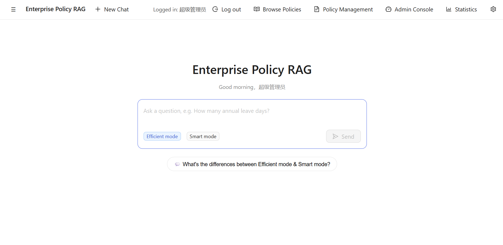
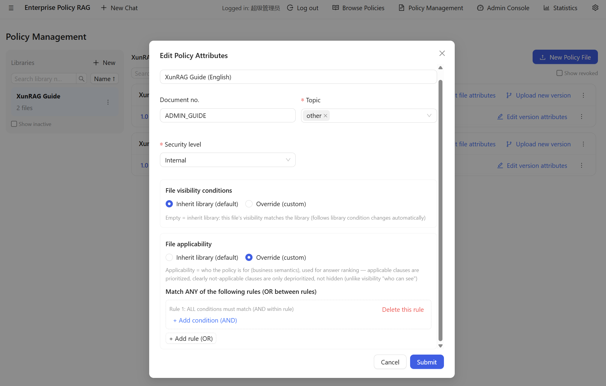
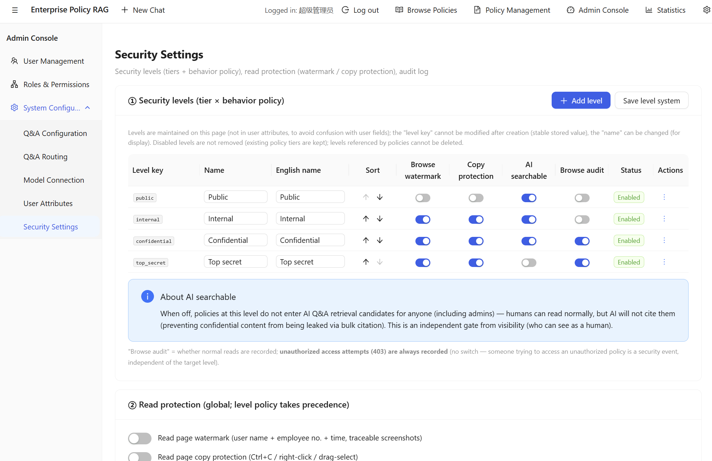

# XunRAG · Enterprise Policy AI Q&A System

> Enterprise-grade **policy management + AI Q&A + action guidance** system (RAG · Retrieval-Augmented Generation). Answers strictly based on policies, citations verifiable, deployable fully on-premises.
> For developers: `npm install` → `pip install` → `npm run setup` → log in — a working system with default config and built-in administrator manual.

[中文](README.zh-CN.md) · English

---

## What is this?

XunRAG turns scattered policy files (OA/email/shared drives) into a **searchable, permission-controlled, versioned** policy knowledge base, and uses LLM + Retrieval-Augmented Generation (RAG) to give employees citable, traceable policy answers and action guidance — solving three core pain points: **can't find** policies, **can't understand** them, and **acting on outdated rules**.

**Core capabilities at a glance**:

- **Permission control**: two-level dynamic visibility (library + file, ABAC attribute rules), effective immediately on hire/transfer/leave, unauthorized content "doesn't exist"
- **Version management**: multiple versions auto-switched by effective date (AI only cites the current effective version), retire/disable = no longer searchable, all actions audited
- **Security levels**: every policy has a level, per-level protections (watermark / copy protection / **AI never cites** / audit)
- **Local LLM**: llama.cpp on-premises inference, **data never leaves the intranet**; also supports DeepSeek / OpenAI / Anthropic cloud APIs
- **Dual mode**: **Efficient mode** (Workflow orchestration + vectorized RAG, fast & stable) / **Smart mode** (Agentic orchestration + non-vector full-text retrieval, deep & thorough)

<div align="center">
  
  <p><em>AI Q&A: citable, verifiable policy answers</em></p>
  
  <p><em>Policy management: full lifecycle of libraries/files/versions/security levels</em></p>
  
  <p><em>Security settings: levels and behavior policy matrix</em></p>
</div>

## Core Features

### AI Q&A
- Answers strictly from the policy library; **rejects directly when no evidence** (code-level anti-hallucination, not prompt-dependent)
- Every conclusion carries a **citation number**, clickable to the original clause
- Intent recognition → pushes **process links / contact cards / risk alerts** alongside the answer
- **Personalized answers** by employee region/level/contract type, tagged 【Applies to you】/【Does not apply】

### Policy Management
- Word / Markdown upload with automatic conversion (pandoc), auto-slicing by headings + **manual drag-adjust confirmation**
- Versions auto-switched by effective date; publishing a new version auto-closes the previous one
- Security level system (configurable tiers + 5 protection switches per tier)

### Permissions & Security
- RBAC functional permissions (roles + managed scope) + ABAC data permissions (two-level visibility/applicability rules)
- Permission-aware retrieval: unauthorized content unreachable via list/search/direct URL
- API Keys encrypted with AES-256-GCM, plaintext never persisted; passwords salted with scrypt
- HTTPS, browse watermark, copy protection, operation audit log

### Deployment & Operations
- **One-command setup** `npm run setup`: environment check → model download guidance → data initialization (admin / config / admin-manual ingestion) → service startup
- Production mode: NSSM process guard, health check + alerting, daily auto-backup, three-layer timeout handling
- Read-only endpoints load-tested at 50 concurrent (0 errors)
- Bilingual UI (zh/en), **answers follow the question language**, language-weighted retrieval

## Quick Start

### Requirements

| Dependency | Version | Check |
|---|---|---|
| Node.js | ≥ 22 | `node --version` |
| Python | ≥ 3.12 | `python --version` |
| pandoc | ≥ 3.0 | `python -c "import pypandoc; print(pypandoc.get_pandoc_version())"` |

### Install dependencies

```bash
git clone <your-repo-url>
cd XunRAG
npm install
pip install -r requirements.txt
```

### Option 1: One-command setup (recommended)

```bash
npm run setup
```

`npm run setup` does everything (verified):

| Step | What it does |
|---|---|
| ① Environment check | Node ≥22 / Python ≥3.12 / pandoc ≥3.0 (fails fast with clear message) |
| ② Dependency check | node_modules / Python packages; hints install commands if missing |
| ③ Model check | Retrieval models (bge-m3/bge-reranker, ~6.5GB) missing → asks whether to auto-download |
| ④ Start search engine | Python (background, logs `data/logs/setup-python.log`) |
| ⑤ Data initialization | admin account / 60 config items / user groups / admin-manual ingestion / vectorization |
| ⑥ Start services | backend + frontend (background, logs `data/logs/setup-backend.log` / `setup-frontend.log`) |
| ⑦ Output guide | access URL / login / the only manual step left |

> Non-interactive environments (CI): `npm run setup -- --skip-models` skips the model download prompt (Efficient mode will be unavailable until models are downloaded later).

**System state after setup** (nothing else to configure):

| Item | Result |
|---|---|
| admin account | `A001` / `Pass1234` (forced password change on first login) |
| Config | 60 items with defaults (including author presets) |
| Library "Help" | The Administrator Manual (zh/en) already ingested — try asking "What is the difference between Efficient and Smart mode?" |
| Vectorization | Manual chunks indexed |

### Option 2: Manual steps (alternative, for debugging/custom setups)

```bash
# ① Download retrieval models (~6.5GB, required once; bge-m3 + bge-reranker)
python tools/download_models.py                       # ModelScope (fast in China)
python tools/download_models.py --source huggingface  # or HuggingFace

# ② Terminal 1: start the search engine (persistent)
python app/python/server.py

# ③ Data initialization (once; admin / config / manual ingestion / vectorization)
npm run init

# ④ Terminal 2: start backend + frontend
npm run dev
```

> `npm run init` only does data initialization (no service startup); `npm run setup` = data initialization + service startup + environment/model checks.

### Log in

> One-command setup (Option 1) already started all services; for manual steps (Option 2) run `npm run dev` in another terminal.

Open **`https://localhost:5173`** (note: https; for the self-signed certificate click "Advanced → Proceed").
Log in with `A001` / `Pass1234` (forced password change on first login).

**The only manual step left**: connect the LLM (required for Q&A) —
- Cloud: log in → System Configuration → Model Connection → Cloud API → enter DeepSeek/OpenAI key → refresh models → select
- Local: download a GGUF into `models/llm/`, select it on the Model Connection page

> ⚠️ Quick start runs in development mode (**no process guard, no auto-backup**). For production (admin PowerShell):
>
> ```bash
> npm run build
> node scripts/gen-cert.mjs                                    # HTTPS certificate
> powershell -ExecutionPolicy Bypass -File scripts\install-services.ps1      # NSSM process guard
> powershell -ExecutionPolicy Bypass -File scripts\register-schedules.ps1    # backup/health/monitor tasks
> ```
>
> Mandatory production env vars: `POLICYBOT_MASTER_KEY` / `POLICYBOT_INITIAL_PASSWORD` / `HTTPS_ENABLED=1`.
> Full deployment/ops/troubleshooting: see the [Administrator Guide](docs/ADMIN_GUIDE.md).

## How it works

```
┌────────────┐  HTTPS/SSE  ┌──────────────┐  HTTP(localhost)  ┌──────────────┐
│  Browser    │ ←────────→ │  Node.js      │ ←───────────────→ │ Python search │
│  React+Vite │            │  orchestration│                   │ engine        │
└────────────┘            └──────┬───────┘                   └──────┬───────┘
                                 │                                   │
                                 │ DeepSeek API / local LLM          │ bge-m3 / Chroma
                                 ▼                                   ▼
                          ┌──────────────┐                    ┌──────────────────┐
                          │  LLM answer   │                    │ chunk vector store│
                          └──────────────┘                    └──────────────────┘
```

- **Dual mode**: Efficient mode = **Workflow orchestration** (LangGraph) + **vectorized RAG** (BM25 lexical + vector semantic RRF fusion + rerank); Smart mode = **Agentic orchestration** (Pi SDK) + **non-vector full-text retrieval** (grep-style, permission-scoped)
- **Dual storage**: SQLite (metadata/config/conversations) + Chroma (vectors), auto consistency check on startup

## Tech Stack

| Layer | Technology |
|---|---|
| Frontend | React 18 · Vite · Ant Design 5 · TypeScript · i18next |
| Backend | Node.js · Express · better-sqlite3 · LangGraph.js |
| Search engine | Python · FastAPI · sentence-transformers(bge-m3) · Chroma · rank_bm25(jieba) · bge-reranker |
| LLM | DeepSeek / OpenAI / Anthropic / custom OpenAI-compatible / local llama.cpp |

## Documentation

| Document | Description |
|---|---|
| [Administrator Guide](docs/ADMIN_GUIDE.md) | Deployment, configuration, permissions, ops, troubleshooting (English) |
| [系统管理员手册](docs/ADMIN_GUIDE.zh-CN.md) | 部署、配置、权限、运维、故障排查（中文） |

> The Administrator Manual is automatically ingested into the "Help" library by `npm run setup` — you can ask the system "how to configure models" directly.

## License

[Apache-2.0](LICENSE) — free for commercial use, modification and redistribution (retain the copyright notice).

---

**XunRAG** — Enterprise policy AI: turning policies from documents into an always-answerable guide.
