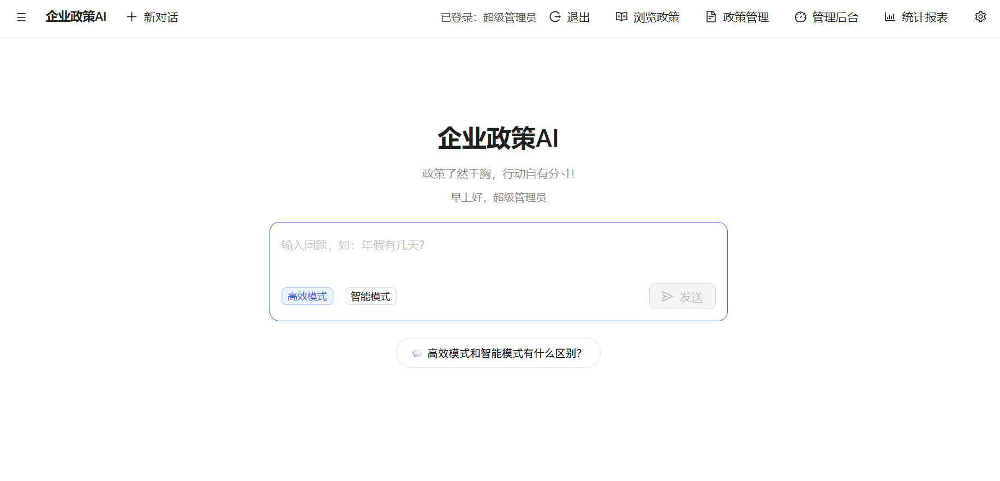
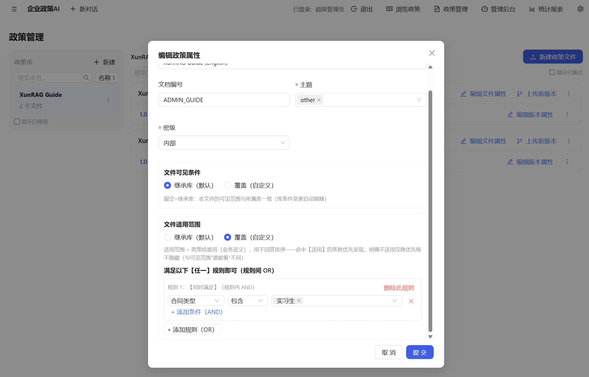
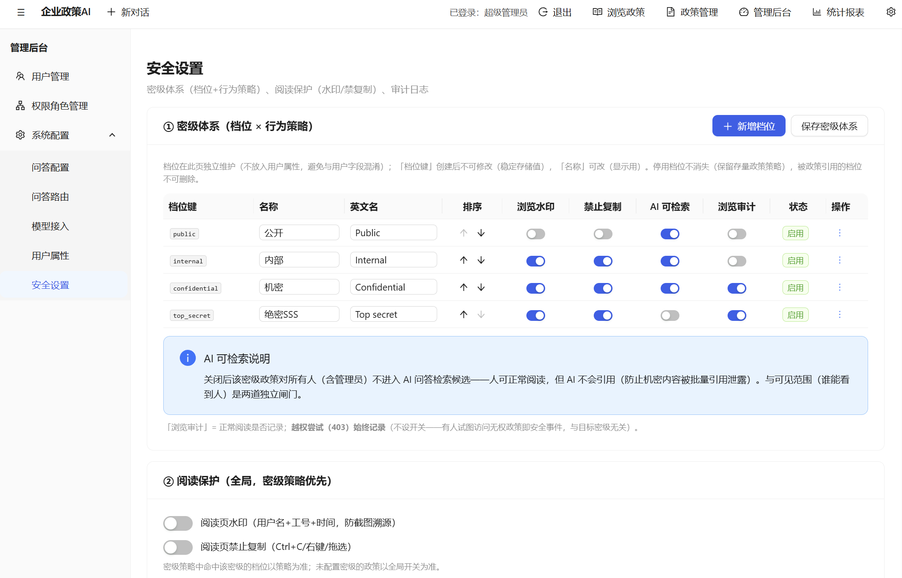

# XunRAG · 企业政策 AI 问答系统

> 企业级**政策管理 + AI 问答 + 行动建议**系统（RAG · 检索增强生成）。严格依据政策回答，引用可核对；严格遵照政策的可见权限、版本、密级检索；根据用户意图、用户基本信息个性化回答；数据、大模型可完全内网、本地部署。
> 快速部署、开箱即用。

[English](README.md) · 中文

---

## 这是什么？

XunRAG 把散落的政策文件，集中治理成**可检索、有权限、有版本**的政策知识库，用大模型（LLM）+ 检索增强生成（RAG）为员工提供带引用、可追溯的政策问答与行动建议——解决员工**找不到、看不懂、不知道去哪里办**三大痛点，提升企业内部的效率与合规。

**核心能力一览**：

- **权限管控**：双层动态权限（政策库 + 政策文件两级可见范围，ABAC 属性规则），员工入转调离实时生效，无权内容"装不存在"
- **版本管理**：多版本按生效日期自动切换（AI 只参考当前生效版本），废止/停用即不可检索，操作留痕审计
- **密级管理**：每篇政策设置密级，按密级施加保护（水印/禁复制/**AI 不引用**/审计）
- **本地大模型**：支持 llama.cpp 本地推理，**数据不出内网**；也支持 DeepSeek/OpenAI/Anthropic 云端 API
- **双模式**：**高效模式**（Workflow 编排 + 向量化 RAG，快而稳）/ **智能模式**（Agentic 编排 + 非向量全文检索，深而全）

<div align="center">
  
  <p><em>AI 问答：带引用、可核对的政策回答</em></p>
  
  <p><em>政策管理：库/文件/版本/密级全生命周期</em></p>
  
  <p><em>安全设置：密级档位与策略矩阵</em></p>
</div>

## 核心特性

### AI 问答
- 严格依据政策库回答，**无依据直接拒答**
- 每个结论带**引用编号**，点击直达原文锚点，可核对
- 意图识别 → 回答的同时推送**流程申请链接 / 对接人卡片 / 风险提示**
- 按员工地区/层级/合同类型**个性化回答**，标注【适用于您】/【不适用于您】

### 政策管理
- Word / Markdown 上传即自动转换，按标题自动切片 + **人工拖拽确认**
- 版本按生效日期自动切换；发布新版自动闭合旧版；废止/停用即不可检索
- 密级体系（档位可配 + 每档 5 项保护策略）

### 权限与安全
- RBAC 功能权限（权限角色 + 管理范围）+ ABAC 数据权限（双层可见/适用规则）
- 权限感知检索：无权内容在列表/搜索/URL 直连均不可达
- API Key AES-256-GCM 加密存储，明文不落库；密码 scrypt 加盐
- HTTPS、阅读水印、禁止复制、操作审计

### 部署与运维
- **一键初始化** `npm run setup`：环境检查 → 模型下载引导 → 数据初始化（admin/配置/操作手册入库）→ 服务启动，一条命令到登录页
- 生产模式：NSSM 进程守护、健康检查+告警、每日自动备份、三层超时治理
- 中英双语界面，**回答跟随提问语言**，语言加权检索

## 快速开始

### 环境要求

| 依赖 | 版本 | 检查命令 |
|---|---|---|
| Node.js | ≥ 22 | `node --version` |
| Python | ≥ 3.12 | `python --version` |
| pandoc | ≥ 3.0 | `python -c "import pypandoc; print(pypandoc.get_pandoc_version())"` |

### 安装依赖

```bash
git clone <your-repo-url>
cd XunRAG
npm install
pip install -r requirements.txt
```

### 方式一：一键初始化（推荐）

```bash
npm run setup
```

`npm run setup` **一条命令完成**（已实测验证）：

| 步骤 | 说明 |
|---|---|
| ① 环境检查 | Node ≥22 / Python ≥3.12 / pandoc ≥3.0（不满足→明确报错） |
| ② 依赖检查 | node_modules / Python 包缺失→提示安装命令 |
| ③ 模型检查 | 检索模型（bge-m3/bge-reranker，约 6.5GB）缺失→询问是否自动下载 |
| ④ 启动检索引擎 | Python（后台常驻，日志 `data/logs/setup-python.log`） |
| ⑤ 数据初始化 | admin 账号 / 60 项配置 / 用户组 / 《操作手册》入库 / 向量化 |
| ⑥ 启动服务 | backend + frontend（后台常驻，日志 `data/logs/setup-backend.log`、`setup-frontend.log`） |
| ⑦ 输出引导 | 访问地址 / 登录账号 / 唯一手动步骤 |

> 非交互环境（CI/无人值守）可用 `npm run setup -- --skip-models` 跳过模型下载询问（高效模式不可用，稍后可手动补下）。

**初始化完成后的系统状态**（无需手动配置）：

| 项 | 结果 |
|---|---|
| admin 账号 | `A001` / `Pass1234`（首登强制改密） |
| 配置 | 60 项默认配置（含开源作者预设值） |
| 政策库「系统帮助」 | 已导入《管理员手册》（中英）——可直接提问"高效模式和智能模式有什么不同" |
| 向量化 | 手册切片已入库 |

### 方式二：手动分步（备选，便于排查/自定义）

```bash
# ① 下载检索模型（约 6.5GB，首次必需；bge-m3 + bge-reranker）
python tools/download_models.py                       # ModelScope（国内快）
python tools/download_models.py --source huggingface  # 或 HuggingFace

# ② 终端 1：启动检索引擎（常驻）
python app/python/server.py

# ③ 数据初始化（一次即可；自动建 admin / 默认配置 / 导入操作手册 / 向量化）
npm run init

# ④ 终端 2：启动后端 + 前端
npm run dev
```

> `npm run init` 仅做数据初始化（不含服务启动）；`npm run setup` = 数据初始化 + 服务启动 + 环境/模型检查。

### 启动与登录

> 一键初始化（方式一）已自动启动全部服务；手动分步（方式二）需另开终端执行 `npm run dev`。

浏览器打开 **`https://localhost:5173`**（注意 https；自签证书点「高级 → 继续前往」）。
登录 `A001` / `Pass1234`（首登强制改密）。

**唯一需要手动配置的**：大模型接入（不配无法问答）——
- 云端：登录后「系统配置 → 模型接入 → 云端 API → 填API Key」
- 本地：下载 GGUF 放入 `models/llm/`，模型接入页选择

> ⚠️ 快速开始为开发模式（**无进程守护、无自动备份**）。正式使用执行生产部署（管理员 PowerShell）：
>
> ```bash
> npm run build
> node scripts/gen-cert.mjs                                    # HTTPS 证书
> powershell -ExecutionPolicy Bypass -File scripts\install-services.ps1      # NSSM 进程守护
> powershell -ExecutionPolicy Bypass -File scripts\register-schedules.ps1    # 备份/探活/监控定时任务
> ```
>
> 生产必设环境变量：`POLICYBOT_MASTER_KEY` / `POLICYBOT_INITIAL_PASSWORD` / `HTTPS_ENABLED=1`。
> 完整部署/运维/排障见 [系统管理员手册](docs/ADMIN_GUIDE.zh-CN.md)。

## 工作原理

```
┌────────────┐  HTTPS/SSE  ┌──────────────┐  HTTP(localhost)  ┌──────────────┐
│  浏览器      │ ←────────→ │  Node.js 后端  │ ←───────────────→ │ Python 检索引擎 │
│  React+Vite │            │ 业务编排+权限   │                   │ 向量+BM25+精排 │
└────────────┘            └──────┬───────┘                   └──────┬───────┘
                                 │                                   │
                                 │ DeepSeek API / 本地 LLM           │ bge-m3 / Chroma
                                 ▼                                   ▼
                          ┌──────────────┐                    ┌──────────────────┐
                          │  LLM 生成回答  │                    │ 政策切片向量库      │
                          └──────────────┘                    └──────────────────┘
```

- **双模式**：高效模式 = **Workflow 编排**（LangGraph）+ **向量化 RAG**（BM25 词法 + 向量语义 RRF 融合 + 精排）；智能模式 = **Agentic 编排**（Pi SDK）+ **非向量全文检索**（grep 风格，权限内）
- **双存储**：SQLite（元数据/配置/对话）+ Chroma（向量），启动时自动一致性校验

## 技术栈

| 层 | 技术 |
|---|---|
| 前端 | React 18 · Vite · Ant Design 5 · TypeScript · i18next |
| 后端 | Node.js · Express · better-sqlite3 · LangGraph.js |
| 检索引擎 | Python · FastAPI · sentence-transformers(bge-m3) · Chroma · rank_bm25(jieba) · bge-reranker |
| 大模型 | DeepSeek / OpenAI / Anthropic / 自定义 OpenAI 兼容 / 本地 llama.cpp |


## 许可证

[Apache-2.0](LICENSE) — 允许商用、修改、分发（保留版权声明即可）。

---

**XunRAG**：企业政策 AI —— 政策了然于胸，行动自有分寸!
